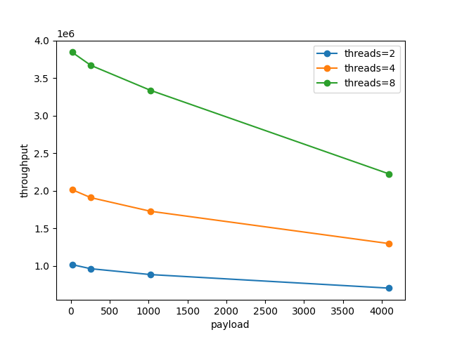

# LibRDPMA, tools to analysis the performance when accessing NVM with RDMA

LibRDPMA provides a set of tools  to analyze the behavior when accessing NVM (i.e., Intel Optane DC persistent memory) with RDMA. These including benchmarks for one-sided RDMA and two-sided RDMA and tools to analyze NVM behavior. 

## Getting Started

### Clone and Build

Building the tools of librdpma is straightforward since it will automatically install dependencies. Specifically, using the following steps:

1. clone the project
   - use `git clone git@github.com:SJTU-DDST/librdpma_fork.git --recursive` to clone submodules
   - or clone normally, and then use `git submodule update --init --recursive`
2. `mkdir build && cd build && cmake ..`
   - compile_commands.json will generate in build/
3. `make -j`
4. `cd ..` to go back

<!-- 不知道为啥，50 上得 sudo 才能编译，有点怪 -->

### Run Benchmark Auto-Scripts

Install requirements and run.

```shell
python3 -m pip install numpy matplotlib
python3 bench_master.py
```

2 new config files will be generated when you run this script for the first time. Modify them in `./configs/*.yaml`.

Within them, `machines.yaml` contains the configures of several machines, while `connections.yaml` contains several testcases of server (single) and clients (multiple) pair; only <server, clients> pairs that are enabled would be test in the script. Note that names of machines/servers/clients must correspond to each other in machines.yaml and connections.yaml.

Modify them and run again.

```shell
vim ./configs/machines.yaml
vim ./configs/connections.yaml
python3 bench_master.py
```

Results will output to `benchres_*.json` and `*.png`, such as

```json
[ 
{"throughput": 1053194.6666666667, "latency": 1.9032220000000002, "server": "localhost", "clients": ["localhost"], "threads": 2, "coros": 1, "payload": 16},
{"throughput": 994628.0666666667, "latency": 2.013740666666667, "server": "localhost", "clients": ["localhost"], "threads": 2, "coros": 1, "payload": 256},
...
{"throughput": 3348694.6666666665, "latency": 2.3953606666666665, "server": "localhost", "clients": ["localhost"], "threads": 8, "coros": 1, "payload": 1024},
{"throughput": 2268334.6666666665, "latency": 3.5285299999999995, "server": "localhost", "clients": ["localhost"], "threads": 8, "coros": 1, "payload": 4096}
]
```

and



## More

### Run Benchmark Mannually

#### 20231010

服务器无法开启：需要打开 hugepage

```shell
sudo sysctl -w vm.nr_hugepages=16384
```

#### 20230606

因为现在主要只需要单边，因此只考虑 nvm_server 和 nvm_client 两个文件即可，server的参数和代码基本上不需要动，client的代码对应 nvm/benchs/one_sided/client.cc， numa的绑定也写死在这个文件里了
```shell
sudo ./scripts/nvm_server --host=0.0.0.0 --port=8964 -use_nvm=false -touch_mem=true --nvm_sz=8 --nvm_file=/dev/dax12.0
```

client 的一个示例参数：

```shell
./scripts/nvm_client -addr="0.0.0.0:8964" --force_use_numa_node=false --use_numa_node=0 --threads=36 --coros=1 --id=0 --use_nic_idx=0 --use_read=true --payload=256 --add_sync=false --address_space=8 --random=true -read_write=true -two_qp=false
```

解释：

* force_use_numa_node 和 use_numa_node: 当前者为true时，仅使用编号为后者的numa node，如果core不够，则exit(1)
* threads, coros: 线程数和协程数
* id: 编号，设为0即可
* use_nix_idx: 使用的RDMA 网卡编号
* use_true: true：测RDMA read, false: 测 RDMA write
* payload: READ read/write payload的大小
* add_sync: 是否doorbell batching
* address_space: 必须 <= server端的nvm_sz, 单位是GB。
* random: 读/写的远端地址是固定的，还是随机一个地址

* 两个后续加的特殊的参数，二者都有些词不达意，所以重点解释下：
    * 默认client的行为：根据use_read的真假不断执行payload 大小的 RDMA read/write, 其中每个coro一个QP
    * two_qp: 为true时，每个coro开两个QP，根据 use_read的真假不断执行两个QP并发执行payload大小的RDMA read/write。此选项为true时，要求 read_write=false
    * read_write: 为true时，每个coro开两个QP。每次操作为：先根据 use_read的真假不断执行两个QP并发执行payload大小的RDMA read/write，然后再用其中一个QP做一个8bytes的write，此选项为true时，要求 two_qp=false
    * doorbell: 为true时，使用doorbell batching来增加并行性。要求two_qp和read_write为false。且设置batch参数，指定doorbell batching的数量。
    * search/update: 为true时，模拟learned index的search和update行为
    * CAS：为true时，测试CAS的性能
    * To do：建议用bench=1,2,3,4,...来替代上面的选项

* 运行脚本在./scripts/

#### original

For the built binaries, `./nvm_rrtserver` and ``./nvm_rrtclient` are used for evaluating two-sided performance, while `./nvm_server` and `./nvm_client` are used for evaluating one-sided performance. We provide scripts to run experiments. For how to configure these binaries, please use `binary --help` to check.

We've also provide scripts to run experiments. For example, to run one-sided evaluations, use the following:

- `cd scripts; ./bootstrap-proxy.py -f run_one.toml`; Note that `run_one.toml` should be configured according to your hardawre setting. It is straightforward to configure it  based on its content. 

### Other tools

We provide some tools for make system configurations or monitor NVM statistics. 

- To tune DDIO setups, use `cd ddio_tools; cmake; make;` and then use `setup_dca`. 
- To monitor NVM read/write amplications, use `cd nvm; python analysis.py`.  Note that `ipmctl` should be installed. 

## Check our results

To check the results of these benchmarks, please refer to our paper: 

[**ATC**] Characterizing and Optimizing Remote Persistent Memory with RDMA and NVM. Xingda Wei and Xiating Xie and Rong Chen and Haibo Chen and Binyu Zang. 2021 USENIX Annual Technical Conference. 
